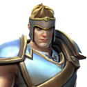
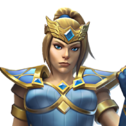
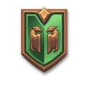
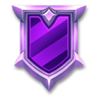

# API Parameter Details

## Response Type
> string

The API supports both [JSON][json_website] and [XML][xml_website] responses. However, we strongly suggest only using [JSON][json_website] when requesting resources.

## Date Format
> string

A DateTime in the following format: ``yyyyMMdd`` - “20191210” (for Dec 10, 2019, as an example)

## Hour
> string

To avoid HTTP timeouts in the [``GetMatchIdsByQueue``](#get-match-ids-by-queue) method, you can now specify a 10-minute window within the specified {hour} field to lessen the size of data returned by appending a “,mm” value to the end of {hour}. For example, to get the match Ids for the first 10 minutes of hour 3, you would specify {hour} as “3,00”.  This would only return the Ids between the time 3:00 to 3:09.  Rules below:
			Only valid values for mm are “00”, “10”, “20”, “30”, “40”, “50”
			To get the entire third hour worth of Match Ids, call [``GetMatchIdsByQueue``](#get-match-ids-by-queue) 6 times, specifying the following values for {hour}: “3,00”, “3,10”, “3,20”, “3,30”, “3,40”, “3,50”. 
			The standard, full hour format of {hour} = “hh” is still supported.

## God ID
> int

The God ID is an unique id for each playable character in a game.

Can be obtained from:
  - [``GetChampions``](./../get-champions.md#get-champions) - Returns a list of all playable characters in [Paladins](#god-id---paladins).
  - [``GetGods``](./../get-gods.md#get-gods) - Returns a list of all playable characters in [Paladins](#god-id---paladins) / [Smite](#god-id---smite).

### God ID - Paladins
> int

Champions are the playable characters in [Paladins][paladins].

Each one has their own unique abilities and fighting style. Champions use Cards to increase their performance and enhance their skills, and Items to help them adapt to specific situations in every match.

Champions are organized into 4 different classes:
  - Damage: These champions can consistently deal high amounts of damage. Damage champions gain 100% more [Credits][credits] for dealing damage to enemy champions. 
  - Flank: These champions excel in both damage and mobility to help them in combat as well as chase and confirm kills from the enemy's rear. However, their low health makes them vulnerable to getting overwhelmed by multiple enemies. Flank champions gain 30% more [Credits][credits] from landing killing blows on enemies. 
  - Front Line: These champions are the best at maintaining control of objectives and protecting their teammates through shields, personal force fields, or just by taking fire. Front Line champions gain 100% more [Credits][credits] for standing near an objective. 
  - Support: These champions offer a wide range of utility, both offensive and defensive. However, they specialize in healing and causing chaos in enemy attacks. Support champions gain 100% more [Credits][credits] for healing allies, and eliminations from healing a target that gets the killing blow on an enemy. Support champions also gain ultimate charge from healing done to teammates besides themselves. Healing that restores 0 Health (for example, healing someone who is at full health) won't provide ultimate charge. 

<details markdown="1">
<summary>Champions</summary>

There are currently 44 playable champions in the game (Updated in 12/09/2019 13:31:38):
<table>
  <tr><th>ID</th><th>Name</th><th>Role</th><th>Title</th><th>Image</th></tr>
  <tr><td>2205</td><td>Androxus</td><td>Flank</td><td>The Godslayer</td><td></td></tr>
    <tr><td>2404</td><td>Ash</td><td>Front Line</td><td>The War Machine</td><td></td></tr>
    <tr><td>2512</td><td>Atlas</td><td>Front Line</td><td>The Man Out of Time</td><td></td></tr>
    <tr><td>2073</td><td>Barik</td><td>Front Line</td><td>The Master Mechanic</td><td></td></tr>
    <tr><td>2281</td><td>Bomb King</td><td>Damage</td><td>His Majesty</td><td></td></tr>
    <tr><td>2147</td><td>Buck</td><td>Flank</td><td>The Unyielding</td><td></td></tr>
    <tr><td>2092</td><td>Cassie</td><td>Damage</td><td>The Hunter's Daughter</td><td></td></tr>
    <tr><td>2495</td><td>Dredge</td><td>Damage</td><td>Admiral of the Abyss</td><td></td></tr>
    <tr><td>2277</td><td>Drogoz</td><td>Damage</td><td>The Greedy</td><td></td></tr>
    <tr><td>2094</td><td>Evie</td><td>Flank</td><td>The Winter Witch</td><td></td></tr>
    <tr><td>2071</td><td>Fernando</td><td>Front Line</td><td>The Self-Appointed Knight</td><td></td></tr>
    <tr><td>2491</td><td>Furia</td><td>Support</td><td>Angel of Vengeance</td><td></td></tr>
    <tr><td>2093</td><td>Grohk</td><td>Support</td><td>The Lightning Orc</td><td></td></tr>
    <tr><td>2254</td><td>Grover</td><td>Support</td><td>The Wild</td><td></td></tr>
    <tr><td>2509</td><td>Imani</td><td>Damage</td><td>The Last Warder</td><td></td></tr>
    <tr><td>2348</td><td>Inara</td><td>Front Line</td><td>The Stone Warden</td><td></td></tr>
    <tr><td>2517</td><td>Io</td><td>Support</td><td>the Shattered Goddess</td><td></td></tr>
    <tr><td>2431</td><td>Jenos</td><td>Support</td><td>The Ascended</td><td></td></tr>
    <tr><td>2479</td><td>Khan</td><td>Front Line</td><td>Primus of house Aico</td><td></td></tr>
    <tr><td>2249</td><td>Kinessa</td><td>Damage</td><td>The Bounty Hunter</td><td></td></tr>
    <tr><td>2493</td><td>Koga</td><td>Flank</td><td>The Lost Hand</td><td></td></tr>
    <tr><td>2362</td><td>Lex</td><td>Flank</td><td>The Hand of Justice</td><td></td></tr>
    <tr><td>2417</td><td>Lian</td><td>Damage</td><td>Scion of House Aico</td><td></td></tr>
    <tr><td>2338</td><td>Maeve</td><td>Flank</td><td>of Blades</td><td></td></tr>
    <tr><td>2288</td><td>Makoa</td><td>Front Line</td><td>The Ancient</td><td></td></tr>
    <tr><td>2303</td><td>Mal'Damba</td><td>Support</td><td>Wekono's Chosen</td><td></td></tr>
    <tr><td>2481</td><td>Moji</td><td>Flank</td><td>and Friends</td><td></td></tr>
    <tr><td>2056</td><td>Pip</td><td>Support</td><td>The Rogue Alchemist</td><td></td></tr>
    <tr><td>2528</td><td>Raum</td><td>Front Line</td><td>Rage of the Abyss</td><td></td></tr>
    <tr><td>2149</td><td>Ruckus</td><td>Front Line</td><td>The Worst of Friends</td><td></td></tr>
    <tr><td>2372</td><td>Seris</td><td>Support</td><td>Oracle of the Abyss</td><td></td></tr>
    <tr><td>2307</td><td>Sha Lin</td><td>Damage</td><td>The Desert Wind</td><td></td></tr>
    <tr><td>2057</td><td>Skye</td><td>Flank</td><td>The Twilight Assassin</td><td></td></tr>
    <tr><td>2438</td><td>Strix</td><td>Damage</td><td>Ghost Feather</td><td></td></tr>
    <tr><td>2472</td><td>Talus</td><td>Flank</td><td>of the Ska'drin</td><td></td></tr>
    <tr><td>2477</td><td>Terminus</td><td>Front Line</td><td>The Fallen</td><td></td></tr>
    <tr><td>2529</td><td>Tiberius</td><td>Damage</td><td>The Weapons Master</td><td></td></tr>
    <tr><td>2322</td><td>Torvald</td><td>Front Line</td><td>The Runic Sage</td><td></td></tr>
    <tr><td>2314</td><td>Tyra</td><td>Damage</td><td>The Untamed</td><td></td></tr>
    <tr><td>2285</td><td>Viktor</td><td>Damage</td><td>The Lone Wolf</td><td></td></tr>
    <tr><td>2480</td><td>Vivian</td><td>Damage</td><td>The Cunning</td><td></td></tr>
    <tr><td>2393</td><td>Willo</td><td>Damage</td><td>of the Summer Court</td><td></td></tr>
    <tr><td>2267</td><td>Ying</td><td>Support</td><td>The Blossom</td><td></td></tr>
    <tr><td>2420</td><td>Zhin</td><td>Flank</td><td>The Tyrant</td><td></td></tr>
  </table>
</details>

### God ID - Realm Royale
> int

There are multiple Classes in [Realm Royale][realm_royale].

Each one has its own unique abilities and fighting style. Each class has a unique passive bonus, movement ability, and 4 special abilities.<br/>Additionally each class can craft a unique weapon at the forge.

<details markdown="1">
<summary>Classes</summary>

There are currently 4 playable classes in the game:
<table>
	<tr><th>ID</th><th>Name</th><th>In-Game Name</th><th>Image</th></tr>
	<tr><td>2285</td><td>Male Tank</td><td>Warrior</td><td></td></tr>
	<tr><td>2493</td><td>Female Damage</td><td>Hunter</td><td></td></tr>
	<tr><td>2494</td><td>Female Support</td><td>Mage</td><td></td></tr>
	<tr><td>2496</td><td>Male Flank</td><td>Assassin</td><td></td></tr>
</table>

</details>

### God ID - Smite
> int

Gods are the playable characters in [Smite][smite].

Each god is unique, with different strengths and weaknesses, and their own playstyle. The statistics of certain gods are geared for offense, while others are better suited for defense.

Gods are organized in 5 different classes:
 - Assassins (mostly melee junglers and gankers).
 - Guardians (mostly melee supports, tanks and initiators).
 - Hunters (mostly ranged carries and fighters).
 - Mages (mostly ranged spellcasters).
 - Warriors (mostly melee bruisers).

<!--
Gods are sorted by their Pantheons:
  - Arthurian
  - Celtic
  - Chinese
  - Egyptian
  - Greek
  - Hindu
  - Japanese
  - Mayan
  - Norse
  - Polynesian
  - Roman
  - Slavic
  - Voodoo
  - Yoruba
-->

<details markdown="1">
<summary>Gods</summary>

There are currently 106 playable gods in the game (Updated in 12/08/2019 16:06:58):
<table>
  <tr><th>ID</th><th>Name</th><th>Role</th><th>Title</th><th>Image</th></tr>
  <tr><td>3492</td><td>Achilles</td><td>Warrior</td><td>Hero of the Trojan War</td><td></td></tr>
    <tr><td>1737</td><td>Agni</td><td>Mage</td><td>God of Fire</td><td></td></tr>
    <tr><td>1956</td><td>Ah Muzen Cab</td><td>Hunter</td><td>God of Bees</td><td></td></tr>
    <tr><td>2056</td><td>Ah Puch</td><td>Mage</td><td>Horrific God of Decay</td><td></td></tr>
    <tr><td>2110</td><td>Amaterasu</td><td>Warrior</td><td>The Shining Light</td><td></td></tr>
    <tr><td>1773</td><td>Anhur</td><td>Hunter</td><td>Slayer of Enemies</td><td></td></tr>
    <tr><td>1668</td><td>Anubis</td><td>Mage</td><td>God of the Dead</td><td></td></tr>
    <tr><td>2034</td><td>Ao Kuang</td><td>Mage</td><td>Dragon King of the Eastern Seas</td><td></td></tr>
    <tr><td>1898</td><td>Aphrodite</td><td>Mage</td><td>Goddess of Beauty</td><td></td></tr>
    <tr><td>1899</td><td>Apollo</td><td>Hunter</td><td>God of Music</td><td></td></tr>
    <tr><td>1699</td><td>Arachne</td><td>Assassin</td><td>the Weaver</td><td></td></tr>
    <tr><td>1782</td><td>Ares</td><td>Guardian</td><td>God of War</td><td></td></tr>
    <tr><td>1748</td><td>Artemis</td><td>Hunter</td><td>Goddess of the Hunt</td><td></td></tr>
    <tr><td>3336</td><td>Artio</td><td>Guardian</td><td>The Bear Goddess</td><td></td></tr>
    <tr><td>1919</td><td>Athena</td><td>Guardian</td><td>Goddess of Wisdom</td><td></td></tr>
    <tr><td>2037</td><td>Awilix</td><td>Assassin</td><td>Goddess of the Moon</td><td></td></tr>
    <tr><td>1809</td><td>Bacchus</td><td>Guardian</td><td>God of Wine</td><td></td></tr>
    <tr><td>1755</td><td>Bakasura</td><td>Assassin</td><td>the Great Devourer</td><td></td></tr>
    <tr><td>3518</td><td>Baron Samedi</td><td>Mage</td><td>God of Life and Death</td><td></td></tr>
    <tr><td>1678</td><td>Bastet</td><td>Assassin</td><td>Goddess of Cats</td><td></td></tr>
    <tr><td>2047</td><td>Bellona</td><td>Warrior</td><td>Goddess of War</td><td></td></tr>
    <tr><td>2008</td><td>Cabrakan</td><td>Guardian</td><td>Destroyer of Mountains</td><td></td></tr>
    <tr><td>2189</td><td>Camazotz</td><td>Assassin</td><td>Deadly God of Bats</td><td></td></tr>
    <tr><td>3419</td><td>Cerberus</td><td>Guardian</td><td>Warden of the Underworld</td><td></td></tr>
    <tr><td>2268</td><td>Cernunnos</td><td>Hunter</td><td>The Horned God</td><td></td></tr>
    <tr><td>1966</td><td>Chaac</td><td>Warrior</td><td>God of Rain</td><td></td></tr>
    <tr><td>1921</td><td>Chang'e</td><td>Mage</td><td>Faerie of the Moon</td><td></td></tr>
    <tr><td>3509</td><td>Chernobog</td><td>Hunter</td><td>Lord of Darkness</td><td></td></tr>
    <tr><td>2075</td><td>Chiron</td><td>Hunter</td><td>The Great Teacher</td><td></td></tr>
    <tr><td>1920</td><td>Chronos</td><td>Mage</td><td>Keeper of Time</td><td></td></tr>
    <tr><td>2319</td><td>Cu Chulainn</td><td>Warrior</td><td>Hound of Ulster</td><td></td></tr>
    <tr><td>1778</td><td>Cupid</td><td>Hunter</td><td>God of Love</td><td></td></tr>
    <tr><td>2270</td><td>Da Ji</td><td>Assassin</td><td>The Nine-Tailed Fox</td><td></td></tr>
    <tr><td>3377</td><td>Discordia</td><td>Mage</td><td>Goddess of Strife</td><td></td></tr>
    <tr><td>2138</td><td>Erlang Shen</td><td>Warrior</td><td>The Illustrious Sage</td><td></td></tr>
    <tr><td>2136</td><td>Fafnir</td><td>Guardian</td><td>The Lord of Glittering Gold</td><td></td></tr>
    <tr><td>1843</td><td>Fenrir</td><td>Assassin</td><td>the Unbound</td><td></td></tr>
    <tr><td>1784</td><td>Freya</td><td>Mage</td><td>Queen of the Valkyries</td><td></td></tr>
    <tr><td>2269</td><td>Ganesha</td><td>Guardian</td><td>God of Success</td><td></td></tr>
    <tr><td>1978</td><td>Geb</td><td>Guardian</td><td>God of Earth</td><td></td></tr>
    <tr><td>1763</td><td>Guan Yu</td><td>Warrior</td><td>Saint of War</td><td></td></tr>
    <tr><td>3344</td><td>Hachiman</td><td>Hunter</td><td>Lord of the Eight Banners</td><td></td></tr>
    <tr><td>1676</td><td>Hades</td><td>Mage</td><td>King of the Underworld</td><td></td></tr>
    <tr><td>1674</td><td>He Bo</td><td>Mage</td><td>God of the Yellow River</td><td></td></tr>
    <tr><td>1718</td><td>Hel</td><td>Mage</td><td>Goddess of the Underworld</td><td></td></tr>
    <tr><td>3558</td><td>Hera</td><td>Mage</td><td>Queen of the Gods</td><td></td></tr>
    <tr><td>1848</td><td>Hercules</td><td>Warrior</td><td>Champion of Rome</td><td></td></tr>
    <tr><td>3611</td><td>Horus</td><td>Warrior</td><td>The Rightful Heir</td><td></td></tr>
    <tr><td>2040</td><td>Hou Yi</td><td>Hunter</td><td>Defender of the Earth</td><td></td></tr>
    <tr><td>1673</td><td>Hun Batz</td><td>Assassin</td><td>the Howler Monkey God</td><td></td></tr>
    <tr><td>1918</td><td>Isis</td><td>Mage</td><td>Goddess of Magic</td><td></td></tr>
    <tr><td>2179</td><td>Izanami</td><td>Hunter</td><td>Matron of the Dead</td><td></td></tr>
    <tr><td>1999</td><td>Janus</td><td>Mage</td><td>God of Portals and Transitions</td><td></td></tr>
    <tr><td>2122</td><td>Jing Wei</td><td>Hunter</td><td>The Oathkeeper</td><td></td></tr>
    <tr><td>3585</td><td>Jormungandr</td><td>Guardian</td><td>The World Serpent</td><td></td></tr>
    <tr><td>1649</td><td>Kali</td><td>Assassin</td><td>Goddess of Destruction</td><td></td></tr>
    <tr><td>2066</td><td>Khepri</td><td>Guardian</td><td>The Dawn Bringer</td><td></td></tr>
    <tr><td>3565</td><td>King Arthur</td><td>Warrior</td><td>Wielder of Excalibur</td><td></td></tr>
    <tr><td>1677</td><td>Kukulkan</td><td>Mage</td><td>Serpent of the Nine Winds</td><td></td></tr>
    <tr><td>1993</td><td>Kumbhakarna</td><td>Guardian</td><td>The Sleeping Giant</td><td></td></tr>
    <tr><td>2260</td><td>Kuzenbo</td><td>Guardian</td><td>King Kappa</td><td></td></tr>
    <tr><td>1797</td><td>Loki</td><td>Assassin</td><td>The Trickster God</td><td></td></tr>
    <tr><td>2051</td><td>Medusa</td><td>Hunter</td><td>The Gorgon</td><td></td></tr>
    <tr><td>1941</td><td>Mercury</td><td>Assassin</td><td>Messenger of the Gods</td><td></td></tr>
    <tr><td>3566</td><td>Merlin</td><td>Mage</td><td>The Master Wizard</td><td></td></tr>
    <tr><td>1915</td><td>Ne Zha</td><td>Assassin</td><td>the Third Lotus Prince</td><td></td></tr>
    <tr><td>1872</td><td>Neith</td><td>Hunter</td><td>Weaver of Fate</td><td></td></tr>
    <tr><td>1980</td><td>Nemesis</td><td>Assassin</td><td>Goddess of Vengeance</td><td></td></tr>
    <tr><td>2214</td><td>Nike</td><td>Warrior</td><td>Goddess of Victory</td><td></td></tr>
    <tr><td>2036</td><td>Nox</td><td>Mage</td><td>Goddess of Night</td><td></td></tr>
    <tr><td>1958</td><td>Nu Wa</td><td>Mage</td><td>Guardian of Heaven</td><td></td></tr>
    <tr><td>1669</td><td>Odin</td><td>Warrior</td><td>The Allfather</td><td></td></tr>
    <tr><td>3664</td><td>Olorun</td><td>Mage</td><td>Ruler of the Heavens</td><td></td></tr>
    <tr><td>2000</td><td>Osiris</td><td>Warrior</td><td>Broken God of the Afterlife</td><td></td></tr>
    <tr><td>3543</td><td>Pele</td><td>Assassin</td><td>Goddess of Volcanoes</td><td></td></tr>
    <tr><td>3705</td><td>Persephone</td><td>Mage</td><td>Queen of the Underworld</td><td></td></tr>
    <tr><td>1881</td><td>Poseidon</td><td>Mage</td><td>God of the Oceans</td><td></td></tr>
    <tr><td>1698</td><td>Ra</td><td>Mage</td><td>Sun God</td><td></td></tr>
    <tr><td>2113</td><td>Raijin</td><td>Mage</td><td>Master of Thunder</td><td></td></tr>
    <tr><td>2002</td><td>Rama</td><td>Hunter</td><td>Seventh Avatar of Vishnu</td><td></td></tr>
    <tr><td>2063</td><td>Ratatoskr</td><td>Assassin</td><td>The Sly Messenger</td><td></td></tr>
    <tr><td>2065</td><td>Ravana</td><td>Assassin</td><td>Demon King of Lanka</td><td></td></tr>
    <tr><td>1988</td><td>Scylla</td><td>Mage</td><td>Horror of the Sea</td><td></td></tr>
    <tr><td>2005</td><td>Serqet</td><td>Assassin</td><td>Goddess of Venom</td><td></td></tr>
    <tr><td>3612</td><td>Set</td><td>Assassin</td><td>The Usurper</td><td></td></tr>
    <tr><td>2107</td><td>Skadi</td><td>Hunter</td><td>Goddess of Winter</td><td></td></tr>
    <tr><td>1747</td><td>Sobek</td><td>Guardian</td><td>God of the Nile</td><td></td></tr>
    <tr><td>2074</td><td>Sol</td><td>Mage</td><td>Goddess of the Sun</td><td></td></tr>
    <tr><td>1944</td><td>Sun Wukong</td><td>Warrior</td><td>the Monkey King</td><td></td></tr>
    <tr><td>2123</td><td>Susano</td><td>Assassin</td><td>God of the Summer Storm</td><td></td></tr>
    <tr><td>2030</td><td>Sylvanus</td><td>Guardian</td><td>Keeper of the Wild</td><td></td></tr>
    <tr><td>2147</td><td>Terra</td><td>Guardian</td><td>The Earth Mother</td><td></td></tr>
    <tr><td>1943</td><td>Thanatos</td><td>Assassin</td><td>Hand of Death</td><td></td></tr>
    <tr><td>2226</td><td>The Morrigan</td><td>Mage</td><td>Phantom Queen</td><td></td></tr>
    <tr><td>1779</td><td>Thor</td><td>Assassin</td><td>God of Thunder</td><td></td></tr>
    <tr><td>2203</td><td>Thoth</td><td>Mage</td><td>Arbiter of the Damned</td><td></td></tr>
    <tr><td>1924</td><td>Tyr</td><td>Warrior</td><td>the Lawgiver</td><td></td></tr>
    <tr><td>1991</td><td>Ullr</td><td>Hunter</td><td>The Glorious One</td><td></td></tr>
    <tr><td>1723</td><td>Vamana</td><td>Warrior</td><td>Fifth Avatar of Vishnu</td><td></td></tr>
    <tr><td>1869</td><td>Vulcan</td><td>Mage</td><td>Smith of the Gods</td><td></td></tr>
    <tr><td>1864</td><td>Xbalanque</td><td>Hunter</td><td>Hidden Jaguar Sun</td><td></td></tr>
    <tr><td>2072</td><td>Xing Tian</td><td>Guardian</td><td>The Relentless</td><td></td></tr>
    <tr><td>3811</td><td>Yemoja</td><td>Guardian</td><td>Goddess of Rivers</td><td></td></tr>
    <tr><td>1670</td><td>Ymir</td><td>Guardian</td><td>Father of the Frost Giants</td><td></td></tr>
    <tr><td>1672</td><td>Zeus</td><td>Mage</td><td>God of the Sky</td><td></td></tr>
    <tr><td>1926</td><td>Zhong Kui</td><td>Mage</td><td>the Demon Queller</td><td></td></tr>
  </table>
</details>

## Language
> int

The language Id that you want results returned in. Default is 1.
<!--
https://flagpedia.net/emoji
https://emojipedia.org/flags/
-->
<details markdown="1">
<summary>Languages</summary>

Valid values are:
<table>
	<tr><th>ID</th><th>Language</th><th>Flag</th></tr>
	<tr><td>1</td><td align='center'>English</td><td>🇺🇸</td></tr>
	<tr><td>2</td><td align='center'>German</td><td>🇩🇪</td></tr>
	<tr><td>3</td><td align='center'>French</td><td>🇫🇷</td></tr>
	<tr><td>5</td><td align='center'>Chinese</td><td>🇨🇳</td></tr>
	<tr><td>7</td><td align='center'>Spanish</td><td>🇪🇸</td></tr>
	<tr><td>9</td><td align='center'>Spanish (Latin America)</td><td>🇦🇷</td></tr>
	<tr><td>10</td><td align='center'>Portuguese</td><td>🇧🇷</td></tr>
	<tr><td>11</td><td align='center'>Russian</td><td>🇷🇺</td></tr>
	<tr><td>12</td><td align='center'>Polish</td><td>🇵🇱</td></tr>
	<tr><td>13</td><td align='center'>Turkish</td><td>🇹🇷</td></tr>
</table>
</details>

## Match ID
> int: <i>The id of a match.</i><br/>

The Match ID is an unique id for each map that’s created by the server for a set of players.

The “match_id” can be obtained from:
  - [``GetMatchHistory``](./../get-match-history.md#get-match-history)
  - [``GetMatchIdsByQueue``](./../get-match-ids-by-queue.md#get-match-ids-by-queue)
  - [``GetPlayerMatchHistory``](./../get-player-match-history.md#get-player-match-history)
  - [``GetPlayerMatchHistoryAfterDateTime``](./../get-player-match-history-after-datetim.md#get-player-match-history-after-datetime)
  - [``GetPlayerStatus``](./../get-player-status.md#get-player-status)
  - [``GetPlayerMatchHistoryAfterDateTime``](./../get-player-match-history-after-datetim.md#get-player-match-history-after-datetime)
  - [``GetTopMatches``](./../get-top-matches.md#get-top-matches).

## Player

This may either be:

### Player Name
> string

This is the Player Name.

### Player ID
> int

The Player ID is an unique id for each player that's is created and internally stored by Hi-Rez.

<!--available to API developers via the /getplayer API method-->
The “player_id” can be obtained from:
  - [``GetPlayer``](./../get-player.md#get-player)
  - [``Get Champion Leaderboard``](./../get-champion-leaderboard#get-champion-leaderboard)
  - [``Get Friends``](./../get-friends#get-friends)
  - [``Get God Leaderboard``](./../get-god-leaderboard#get-god-leaderboard)
  <!--- [``Get Leaderboard``](./../get-leaderboard#get-leaderboard)-->
  - [``Get League Leaderboard``](./../get-league-leaderboard#get-league-leaderboard)
  - [``Get Match Details``](./../get-match-details#get-match-details)
  - [``Get Player Batch From Match``](./../get-player-batch-from-match#get-player-batch-from-match)
  - [``Get Player Id By Name``](./../get-player-id-by-name#get-player-id-by-name)
  - [``Get Player Id By Portal User Id``](./../get-player-id-by-portal-user-id#get-player-id-by-portal-user-id)
  - [``Get Player Id Info For Xbox And Switch``](./../get-player-id-info-for-xbox-and-switch#get-player-id-info-for-xbox-and-switch)
  - [``Get Player Ids By Gamer Tag``](./../get-player-ids-by-gamer-tag#get-player-ids-by-gamer-tag)
  - [``Get Team Players``](./../get-team-players#get-team-players)
  - [``Search players``](./../search-players#search-players)

### Portal User Id
The (usually) 3rd-Party identifier for a Portal.  Examples:  Steam ID, PS4 GamerTag, Xbox GamerTag, Switch GamerTag.

### Steam ID
> int

This is the Player Steam ID.

### Gamer Tag
> string

Typically an alphanumeric descriptor of an individual on a [Portal](#portal-id). This value might not be unique depending on [Portal](#portal-id).

## Portal
> int

A “Portal” is a gateway into our games via an identifier.  In the past it would have been synonymous with a hardware platform... but because of gateways such as “Steam” it is more than just a hardware platform.

<details markdown="1">
<summary>Platforms</summary>

Represents Platform as follows:
<table>
  <tr><th>ID</th><th>Platform</th><th>Image</th></tr>
  <tr><td>1</td><td>Hi-Rez</td><td></td></tr>
  <tr><td>5</td><td>Steam</td><td></td></tr>
  <tr><td>9</td><td>PS4</td><td></td></tr>
  <tr><td>10</td><td>Xbox</td><td></td></tr>
  <tr><td>14</td><td>Mixer</td><td></td></tr>
  <tr><td>22</td><td>Nintendo Switch</td><td></td></tr>
  <tr><td>25</td><td>Discord</td><td></td></tr>
</table>
</details>

<!--
## Platform type

Windows = 1
Mac = 2
Xbox_Nintendo = 3
PSN = 4
#9: ????? #10: ?????
-->

## Season
> int

The season of a league. Starts at 1 and increases by 1 for each calendar year.

- [Paladins][paladins]: As of 2019-12-09 we are currently on season 3.
- [Smite][smite]: As of 2019-12-09 we are currently on season 6.

## League Tier
> int

<details markdown="1">
<summary>Tiers</summary>

Valid values are:
<table>
  <tr><th>ID</th><th>Description</th><th>Image</th></tr>
  <tr><td>0</td><td>Unranked</td><td></td></tr>
    <tr><td>1</td><td>Bronze V</td><td></td></tr>
    <tr><td>2</td><td>Bronze IV</td><td></td></tr>
    <tr><td>3</td><td>Bronze III</td><td></td></tr>
    <tr><td>4</td><td>Bronze II</td><td></td></tr>
    <tr><td>5</td><td>Bronze I</td><td></td></tr>
    <tr><td>6</td><td>Silver V</td><td></td></tr>
    <tr><td>7</td><td>Silver IV</td><td></td></tr>
    <tr><td>8</td><td>Silver III</td><td></td></tr>
    <tr><td>9</td><td>Silver II</td><td></td></tr>
    <tr><td>10</td><td>Silver I</td><td></td></tr>
    <tr><td>11</td><td>Gold V</td><td></td></tr>
    <tr><td>12</td><td>Gold IV</td><td></td></tr>
    <tr><td>13</td><td>Gold III</td><td></td></tr>
    <tr><td>14</td><td>Gold II</td><td></td></tr>
    <tr><td>15</td><td>Gold I</td><td></td></tr>
    <tr><td>16</td><td>Platinum V</td><td></td></tr>
    <tr><td>17</td><td>Platinum IV</td><td></td></tr>
    <tr><td>18</td><td>Platinum III</td><td></td></tr>
    <tr><td>19</td><td>Platinum II</td><td></td></tr>
    <tr><td>20</td><td>Platinum I</td><td></td></tr>
    <tr><td>21</td><td>Diamond V</td><td></td></tr>
    <tr><td>22</td><td>Diamond IV</td><td></td></tr>
    <tr><td>23</td><td>Diamond III</td><td></td></tr>
    <tr><td>24</td><td>Diamond II</td><td></td></tr>
    <tr><td>25</td><td>Diamond I</td><td></td></tr>
    <tr><td>26</td><td>Master</td><td></td></tr>
    <tr><td>27</td><td>Grandmaster</td><td></td></tr>
</table>
</details>

## Status
> int

Represents Player Status as follows:
<table>
  <tr><th>ID</th><th>Type</th><th>Description</th></tr>
  <tr><td>0</td><td>Offline</td><td></td></tr>
  <tr><td>1</td><td>In Lobby</td><td>Basically anywhere except god selection or in game.</td></tr>
  <tr><td>2</td><td>God Selection</td><td>Player has accepted match and is selecting god before start of game.</td></tr>
  <tr><td>3</td><td>In Game</td><td>Match has started.</td></tr>
  <tr><td>4</td><td>Online</td><td>Player is logged in, but may be blocking broadcast of player state.</td></tr>
  <tr><td>5</td><td>Unknown</td><td>Player not found.</td></tr>
</table>

## Signature
> string

The Signature is created by concatenating several fields and then hashing the result with an MD5 algorithm.

A distinct signature is required for each API method called.

The components of this hash are (in order):
<table>
  <tr>
  	<th>Name</th>
  	<th>Description</th>
  	<th>Example</th>
  </tr>
  <tr>
  	<td>dev_id</td>
  	<td></td>
  	<td>“1004”</td>
  </tr>
  <tr>
  	<td>Method</td>
  	<!-- The method name being called -->
  	<td>Which “method” means the resource you want to retrieve data<br/>This will not include the [Response Type](#response-type), just the name of the method.
   </td>
  	<td>“createsession”</td>
  </tr>
  <tr>
  	<td>auth_key</td>
  	<td></td>
  	<td>“23DF3C7E9BD14D84BF892AD206B6755C”</td>
  </tr>
  <tr>
  	<td>timestamp</td>
  	<td>Current UTC [Timestamp](#timestamp)</td>
  	<td>“20191128030916”</td>
  </tr>
</table>

<details>
 <summary>C# Sample</summary>

```csharp
private static string generate_signature(int dev_id, string method, string auth_key, string timestamp) {
  using (var md5 = System.Security.Cryptography.MD5.Create()) {
    var bytes = md5.ComputeHash(System.Text.Encoding.UTF8.GetBytes(dev_id + method + auth_key.ToLower() + timestamp));
    var string_builder = new System.Text.StringBuilder();
    foreach (byte b in bytes)
      string_builder.Append(b.ToString("x2").ToLower());
    return string_builder.ToString();
  }
}
var signature = generate_signature(1004, "createsession", "23DF3C7E9BD14D84BF892AD206B6755C", get_timestamp());
```
</details>

<details>
 <summary>Java Sample</summary>

```java
private static String generate_signature(int dev_id, String auth_key, String method, String timestamp) {
  String template_signature = dev_id + method + auth_key + timestamp;
  StringBuilder string_builder = new StringBuilder();
  try {
    MessageDigest md = MessageDigest.getInstance("MD5");
    md.update (template_signature.getBytes());
    byte [] bytes = md.digest();

    for (byte b : bytes) {
      String hex = Integer.toHexString(0xff & b);
      if (hex.length () == 1)
        string_builder.append("0");
      string_builder.append(hex);
    }
  } catch (NoSuchAlgorithmException e) {
    e.printStackTrace();
  }

  return string_builder.toString();
}

public final String signature = generate_signature(1004, "createsession", "23DF3C7E9BD14D84BF892AD206B6755C", get_timestamp());
```
</details>

<details>
 <summary>Javascript Sample</summary>

```js
const md5 = require("md5");
function generate_signature(dev_id, method, auth_key, timestamp) {
  return md5(`${dev_id}${method}${auth_key}${timestamp}`);
}
var signature = generate_signature(1004, "createsession", "23DF3C7E9BD14D84BF892AD206B6755C", get_timestamp());
```
</details>

<details>
 <summary>PHP Sample</summary>

```php
private function generate_signature($dev_id, $method, $auth_key, $timestamp) {
    return md5($dev_id . $method . $auth_key . $timestamp);
}
```
</details>

<details>
 <summary>Python Sample</summary>

```python
def generate_signature(dev_id, method, auth_key, timestamp):
	from hashlib import md5
	return md5(f'{dev_id}{method.lower()}{auth_key}{timestamp}'.encode('utf-8')).hexdigest()
signature = generate_signature(1004, 'createsession', '23DF3C7E9BD14D84BF892AD206B6755C', get_timestamp())
```
<!--
	>>> def sign(method, timestamp='20191128030916', encoding='utf-8'):
	  from hashlib import md5
	  return md5(f'1004{method.lower()}23DF3C7E9BD14D84BF892AD206B6755C{timestamp}'.encode(encoding)).hexdigest()
	>>> sign('createsession')
	'2bd92e62f3703da55f8b117f8a6228bd'
-->
</details>

## Timestamp
> string

Current UTC time (GMT+0) in the following format: “**``YYYYMMDDHHmmss``**”.

**Timestamps** are used by [**Signatures**](#signature) and embedded into URLs when sending requests, they have to be formatted properly to ensure the request completes without error.

<details>
 <summary>C# Sample</summary>

```csharp
public static string get_timestamp(string _format="yyyyMMddHHmmss") {
  return System.DateTime.UtcNow.ToString(_format);
}
var timestamp = get_timestamp();
```
</details>

<details>
 <summary>Java Sample</summary>

```java
private static String get_timestamp() {
  SimpleDateFormat sdf = new SimpleDateFormat("yyyyMMddHHmmss");
  sdf.setTimeZone(new SimpleTimeZone(SimpleTimeZone.UTC_TIME, "UTC"));
  return sdf.format(new Date());
}
public final String timestamp = get_timestamp();
```
</details>


<details>
 <summary>Javascript Sample</summary>

```js
const moment = require("moment");
function get_timestamp() {
  return moment.utc().format("YYYYMMDDHHmmss");
}
var timestamp = get_timestamp();
```
</details>

<details>
 <summary>PHP Sample</summary>

```php
private function get_timestamp() {
  return Carbon::now()->format('Ymdhis');
}
```
</details>

<details>
 <summary>Python Sample</summary>

```python
def get_timestamp(_format='%Y%m%d%H%M%S'):
  from datetime import datetime
  return datetime.utcnow().strftime(_format)
timeStamp = get_timestamp()
```
</details>

[json_website]: https://json.org/ "Visit json.org"
[xml_website]: https://www.w3.org/XML/ "Visit w3.org/XML"
[paladins]: https://www.paladins.com/ "Paladins"
[realm_royale]: https://www.realmroyale.com/ "Realm Royale"
[smite]: https://www.smitegame.com/ "Smite"
